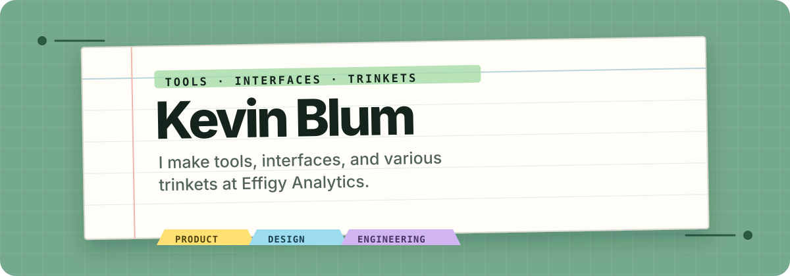

  

  <a href="https://kevinblum.dev">Website</a>
  ·
  <a href="https://github.com/kevinBlum/kevinblum.dev">Site source</a>
  ·
  <a href="https://www.linkedin.com/in/kevin-blum/">LinkedIn</a>
  ·
  <a href="mailto:kevin@kevinblum.dev">Email</a>
  ·
  <a href="https://www.instagram.com/noahs_roommate/">Film photography</a>

## hello, my name's kevin

I am a Lead, Cloud Engineer at Prudential Financial and a builder at
**[Effigy Analytics](https://effigy-analytics.com)**, a two-person software
studio. Most of my professional cloud work is private, so this profile focuses
on work I can share.

### selected work

#### [Morass](https://github.com/effigy-analytics/morass)

A public React interface foundation with typed primitives, accessibility and
theme contracts, and package-integrity checks.

- [Live showcase](https://effigy-analytics.com/morass)
- [Public contract](https://github.com/effigy-analytics/morass/blob/main/docs/public-contract.md)
- `npm install @effigy-analytics/morass`

#### Effigy Awards

Predictions, personal ballots, and leaderboards for awards-season groups. The
central product idea is simple: preserve both who someone **expects** to win and
who they **want** to win. It is currently in private pilot and release work.

### on the workbench

- **Deposition, Scry, and Notation** — three game experiments moving toward
  public screenshots and playable proof.
- **Webbery** — personal and household operations software.

### how I tend to work

- Think about delivery, operations, and rollback.
- Put shared behavior behind documented contracts.
- Keep private systems out of public materials.

Outside software, I take film photographs, travel when I can, and keep
occasional writing. The selected work, photo archive, and other field notes live
at **[kevinblum.dev](https://kevinblum.dev)**.
